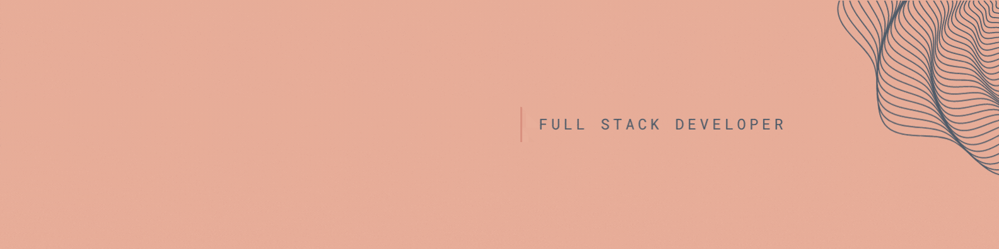
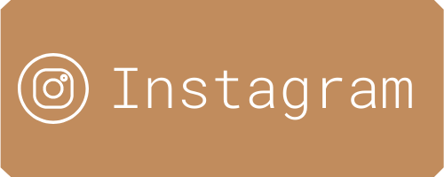

    

&nbsp;

 
  
   
 
 

# Oh hi! 
I'm Emily, a full stack developer in training with a love for colour and style. 

👩🏻‍💻 Currently working on my portfolio and my final bootcamp project at School of Code. 

🌱 Learning how to make a full stack lifestyle app with next.js.  

☀️ Fun fact: I drove from Portugal back to England in a van with a mattress, two plants and a load of crockery after living there last year.

&nbsp;

<h3>Skills:</h3>

  
  
  
  
  

 

&nbsp;
  

&nbsp;
 

